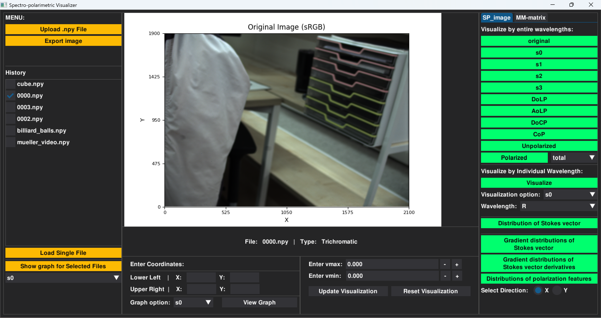
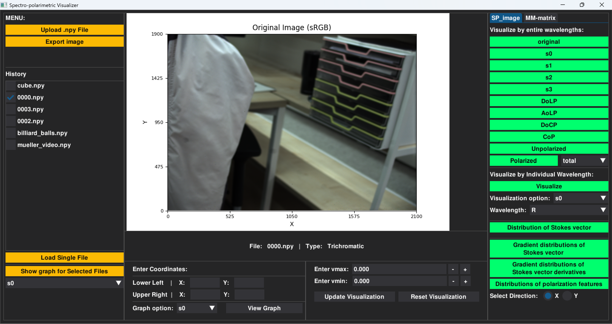

# README

# SPV: Spectro-Polarimetric Visualizer

[[Click here to download Spectro-Polarimetric Data]](https://huggingface.co/datasets/jyj7913/spectro-polarimetric)

<p align="center">
  
  
</p>

## Installation & Running

You must have at least *Python 3.10* before running code below.

```bash
git clone https://github.com/chyngg/SPV_Spectro-Polarimetric-Visualizer.git
cd SPV_Spectro-Polarimetric-Visualizer
pip install dearpygui dearpygui-extend matplotlib numpy opencv-python scipy
python spectro_polarimetric_visualizer.py
```

## Features

### Spectro-Polarimetric image:

- Visualize for entire wavelengths:
    - Full Stokes parameters (`s0`, `s1`, `s2` , `s3`)
    - Polarization feature maps (`DoLP`, `AoLP`, `DoCP`, `CoP`)
    - Unpolarized/Polarized light
    - Histogram visualization
        - Stokes vector distribution
        - Gradient distributions
        - Gradient derivatives distribution
        - Polarization feature gradients (`DoLP`, `AoLP`, `DoCP`, `CoP`)
- Visualize for individual wavelengths:
    - Full Stokes parameters (`s0`, `s1`, `s2` , `s3`)
    - Polarization feature maps (`DoLP`, `AoLP`, `DoCP`, `CoP`)
- RGB approximation from hyperspectral data
- Region-based graph plotting across wavelengths
    - Stokes parameters (`s0`, `s1`, `s2` , `s3`)
    - Polarization features (`DoLP`, `AoLP`, `DoCP`, `CoP`)
- Graph plotting for multiple `.npy` files
    - Stokes parameters (`s0`, `s1`, `s2` , `s3`)
    - Polarization features (`DoLP`, `AoLP`, `DoCP`, `CoP`)
- Save the visualization as `.png`

### For Mueller-matrix image / video:

- **View Mode**: Toggle between Matrix and Decomposition views.
- **Matrix View Mode**:
    - Visualize full 4x4 Mueller matrix tiles for each channel (R/G/B).
    - Correction options: Original / Gamma Correction / m00 Normalization / m00 (Keep Intensity).
    - Visualize Positive / Negative values as RGB images.
    - Generate histograms for individual Mueller matrix elements ($m_{00}$ to $m_{33}$)
    - Simulate Output Stokes vector *($S_{out}$) by applying predefined or custom Input Stokes vectors ($S_{in}$)*. The resulting $*S_{out}*$ supports interactive region-based graph plotting across channels, identical to standard spectro-polarimetric images.
- **Decomposition View Mode (Lu-Chipman Decomposition)**:
    - Extract and visualize physical parameters as 2D heatmaps:
        - Depolarization Index, Diattenuation, Polarizance, Linear Retardance.
        - Visualize decomposed components as 4x4 matrix grids:
            - `Matrix: Diattenuator`, `Matrix: Retarder`, `Matrix: Depolarizer`, `Matrix Corrected`
- For video visualization: The video format must be a `.npy` file of shape `(T(frames), H, W, 3, 4, 4)`

## About

This project was created by Chaeyeong Lee.
When using SPV in academic projects, please cite:

```
@software{SPV,
    title = {Spectro-Polarimetric Visualizer},
    author = {Chaeyeong LEE and Seunghwan BAEK},
    version = {1.1.1},
    year = 2025
}
```